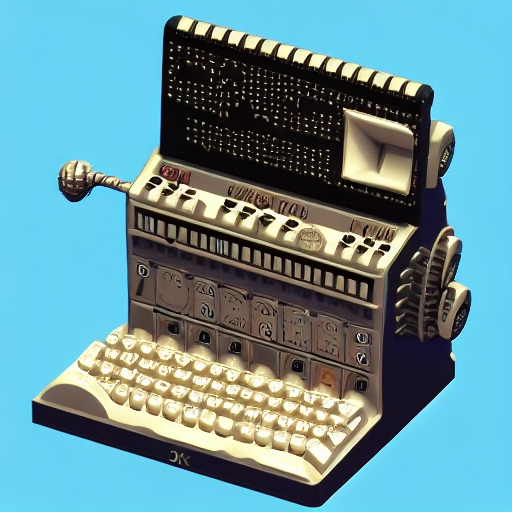

MSM: McSpaghettiMonster
========
I present to you an enigma inspired monte carlo flying spaghetti monster and your goal is to find pairs of entanglement (two nodes connected by some path) and order them by shortest distance; you must find the quickest (smallest spaghetti noodle) way through a chaotic network of other noodles (monster).





### Enigma Inspired
We are passing signals through a bunch of spinning and swapping rotors. Signals also pass through a plugboard. They also bounce off a reflector so, just like enigma, machine output will return any combination except the combination that was just pressed.

### Monte Carlo
Monte Carlo methods, or Monte Carlo experiments, are a broad class of computational algorithms that rely on repeated random sampling to obtain numerical results. The underlying concept is to use randomness to solve problems that might be deterministic in principle.

- https://www.npmjs.com/package/seedrandom

```js
// random number generator
var rng = seedrandom.xor4096('unique seed here...')
console.log('crosswire 1 distance', rng());                // Always 0.9282578795792454
console.log('crosswire 2 distance', rng());                // Always 0.3752569768646784
console.log('crosswire 3 distance', rng());                // Always 0.1483929823472782
// etc...
```

### Navigating Nightmare
Currently post-quantum cryptography research is mostly focused on six different approaches:
- Lattice-based cryptography
- Multivariate cryptography
- Hash-based cryptography
- Code-based cryptography
- Supersingular elliptic curve isogeny cryptography
- Symmetric key quantum resistance

The core difficult problem that Lattice-based cryptography relies on is, "I present to you a lattice and your goal is to find two points that are relatively close to each other." These kinds of problems within lattices are known as the shortest-vector problem (SVP) and/or the Closest Vector Problem (CVP).

> i'd like to propose an additional approch to the list that relies on navigation-based cryptography.

- https://github.com/bbecquet/jkstra

```js
let path = dijkstra.shortestPath(mechanics.nodes[startNode], mechanics.nodes[mechanics.completeId], {
  edgeCost: function (e) {
    if (e.data.part === 'crosswire') {
      return e.data.length; // distance
    } else {
      return 0;
    }
  },
});
```

### Symetric Key
What made the enigma machine secure was all the different rotor wiring combinations. What made it not secure was if these wiring combinations fell into the wrong hands. In order to prevent such configuration from being exposed we use keys instead. They are symetric so the key that was used to encrypt a message is the only key that can decrypt said message.

After obtaining, during machine setup, said key is used as a "unique seed" in order to generate random numbers (xor4096) which are then applied to rotor wiring combinations. So there is no need to communicate indevidual machine settings because machine settings are generated. We need only to communicate keys.

### Code Example
The function "highlyScrambled.build" will create as many machines that you want which will have as many rotors that you want which will have as many base combinations as you want. Early versions of enigma had 3 rotors with 26 pins or base combinations.

Notice how "Layer By" is used to split up a message into smaller chunks. In the spec below messages will be split by the space character.

Mechanically speaking, when ciphering, for each layer of a message we trigger a reordering of all rotors then for each combination we trigger a respinning of all rotors. Which is much more complicated than enigma which turned rotors around like a car's milage tracker.

The "main" variable is important because it complicates things even more as we use it's value to wire up the plugboard. Therefore, each combination must be unique and their positioning is crucial.

```js
// init 
let database = await highlyScrambled.database(com.database.server)
let db = await highlyScrambled.db()

// 26 + 26 + 10 + 10 = 72 max combinations
let main = 'abcdefghijklmnopqrstuvwxyzABCDEFGHIJKLMNOPQRSTUVWXYZ1234567890!@#$%^&*()';

// specification
let demo = {
  key: 'isTrav',
  scramble: main,
  machineCount: 1,
  rotorCount: 4,
  baseCount: 26,
  layerBy: ' ',
  environment: {
    galaxy: 'a', // shift cipher
    star: 'a', // modulo cipher
    core: 'a' // route cipher
  }
}

// construct
let quorum = await highlyScrambled.build(demo)
let machine = await quorum.bestMachine(db)

// run calculation:
// only "main" combinations allowed
let message = 'hello world from austin texas'
let secret = await machine.channel(db, message)

// answer
console.log(secret)
```

### Encoded Secret
```bash
{
  original: 'hello world from austin texas',
  scrambled: 'cuiiq fqgim wgqd zexnlt nuszx',
  messages: [
    { original: 'hello', scrambled: 'cuiiq', code: [Array] },
    { original: 'world', scrambled: 'fqgim', code: [Array] },
    { original: 'from', scrambled: 'wgqd', code: [Array] },
    { original: 'austin', scrambled: 'zexnlt', code: [Array] },
    { original: 'texas', scrambled: 'nuszx', code: [Array] }
  ]
}
```

### Decoded Secret
```bash
{
  original: 'cuiiq fqgim wgqd zexnlt nuszx',
  scrambled: 'hello world from austin texas',
  messages: [
    { original: 'cuiiq', scrambled: 'hello', code: [Array] },
    { original: 'fqgim', scrambled: 'world', code: [Array] },
    { original: 'wgqd', scrambled: 'from', code: [Array] },
    { original: 'zexnlt', scrambled: 'austin', code: [Array] },
    { original: 'nuszx', scrambled: 'texas', code: [Array] }
  ]
}
```
