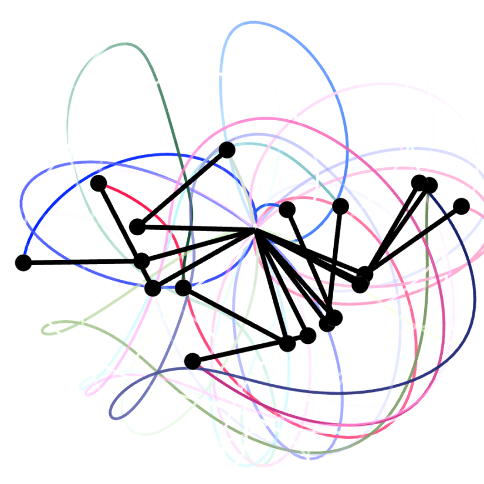

secret-optimizer
========
I present to you a source to randomness (entropy) and your goal is clone it to another location without others figuring out it's contents.

| System                       | User                            |
| ---------------------------- | ------------------------------- |
|  |  |

I present to you an enigma inspired monte carlo flying spaghetti monster and your goal is to find pairs of entanglement (two nodes connected by some path) and order them by shortest distance; you must find the quickest (smallest spaghetti noodle) way through a scrambled network of other noodles (monster) if you want to uncover generated entropy.

| Spaghetti                | Monster                  |
| ------------------------ | ------------------------ |
|  |  |

I present to you a path that randomly traverses over a sea of entropy and your goal is to figure out where the secret message is hidden within it.

| Route                    | Foam                       |
| ------------------------ | -------------------------- |
|  |  |

flow:
- every user is able to connect with every other user via signaling server.
- once a connection is established a DiffieHellman key exchange happens.
- the secretly established keys are then used to configure scramble machines.
- meanwhile a ball bouncing machine is run on each user's end to generate entropic one time pads (OTP).
- after 5,000 OTPs the scramblers are then used to relay them between each other.
- both users merge their OTPs together and then place all 10,000 OTPs in a 2D grid via spiral pattern.
- a double swinging pendulum infinitely iterates over the 2D grid thus producing an infinitely long shared stream.
- this new OTP stream is then used to encode and decode messages between both parties.
- perfect secrecy.

dependants:
- https://github.com/trabur/social-optimizer
- https://github.com/trabur/idea-optimizer
- https://github.com/trabur/fleet-optimizer

requirements:
- https://github.com/trabur/signaling

### Node Package Manager
Algorithm is programmed in TypeScript and runs in both environments client/browser and server/node.js. This is the only language that is currently supported for now. Waiting for API to stabalize before implementing elsewhere.

- https://www.npmjs.com/package/secret-optimizer

```bash
npm install secret-optimizer
```

### Enigma Inspired
We are passing signals through a bunch of spinning and swapping rotors. Signals also pass through a plugboard. They also bounce off a reflector so, just like enigma, machine output will return any combination except the combination that was just pressed.

### Monte Carlo
Monte Carlo methods, or Monte Carlo experiments, are a broad class of computational algorithms that rely on repeated random sampling to obtain numerical results. The underlying concept is to use randomness to solve problems that might be deterministic in principle.

- https://www.npmjs.com/package/seedrandom

```js
// random number generator
var rng = seedrandom.xor4096('unique seed here...')
console.log('crosswire 1 distance', rng());                // Always 0.9282578795792454
console.log('crosswire 2 distance', rng());                // Always 0.3752569768646784
console.log('crosswire 3 distance', rng());                // Always 0.1483929823472782
// etc...
```

### Navigating Nightmare
Currently post-quantum cryptography research is mostly focused on six different approaches:
- Lattice-based cryptography
- Multivariate cryptography
- Hash-based cryptography
- Code-based cryptography
- Supersingular elliptic curve isogeny cryptography
- Symmetric key quantum resistance

The core difficult problem that Lattice-based cryptography relies on is, "I present to you a lattice and your goal is to find two points that are relatively close to each other." These kinds of problems within lattices are known as the shortest-vector problem (SVP) and/or the Closest Vector Problem (CVP).

> i'd like to propose an additional approch to the list that relies on navigation-based cryptography.

- https://github.com/bbecquet/jkstra

```js
let path = dijkstra.shortestPath(mechanics.nodes[startNode], mechanics.nodes[mechanics.completeId], {
  edgeCost: function (e) {
    if (e.data.part === 'crosswire') {
      return e.data.length; // distance
    } else {
      return 0;
    }
  },
});
```

### Character Stuffing
After scrambling there are still gaps between each layer that reveal parts of the secret. So for each gap we fill it in by taking the letter on the left and the letter on the right, match them up on a vigenere square, and then stuff it's result right into the gap, thus forming a complete stream of random nonsense.

### Frequency Smoother
In order to prevent attacks against character frequency analysis, before messages are passed into the plugboard for scrambling, we make sure that on average at least every combination is pressed once. (status: not impemented)

### Entropy
The original enigma owners saw the design of one combination not being able to scramble back into itself as a benifit others saw it as a major flaw. Perhaps it's biggest flaw is that it's movements were predictable and they didn't take advantage of machine output where it could have been feed right back into the system configuration settings thus impacting further output even more.

For instance, when Blechly Park cracked enigma they were able to take advantage of the fact that a 1000 piece puzzle can be solved by multiple people designated to different areas of the puzzle (parrallel). What was described above as our entropy is what would make solving this puzzle even harder (concurrent) because we are saying that piece A must be solved before piece B and piece C before D etc... 

Best case we throw our 1000 piece puzzle on the floor and pick up one piece after another while ciphering; thus, we have enfored that the puzzle can only be solved by repeating the exact same steps.

```js
// location: database/methods/machines.ts - within the cipher method
let ciphertext: string = ''
if (combination) {
  console.log('combination', combination.number)
  if (channelCount === 1 && keyPressCount === 1) {
    console.log('scramble & assemble')
    await this.scramble(db)
    await this.assemble(db)
  } else {
    await this.tick(db, channelCount, keyPressCount, entropy)
  }
  ciphertext = await this.runCalculation(db, letter)
} else {
  console.log('combination not found')
}
```

### Symetric Key
What made the enigma machine secure was all the different rotor crosswiring combinations. What made it not secure was if these crosswiring combinations fell into the wrong hands. In order to prevent such configuration from being exposed we use keys instead. They are symetric so the key that was used to encrypt a message is the only key that can decrypt said message.

After obtaining, during machine setup, said key is used as a "unique seed" in order to generate random numbers (xor4096) which are then applied to rotor crosswiring combinations. So there is no need to communicate individual machine settings because machine settings are generated. We need only to communicate keys.

### Key Exchange
What happens if you want to securely share keys with someone over an untrusted network such as the internet in plain text? We use the DiffieHellman Key Exchange of course :)

- https://nodejs.org/api/crypto.html#class-diffiehellman

```js
import assert from 'node:assert';

const {
  createDiffieHellman
} = await import('node:crypto');

// Generate Alice's keys...
const alice = createDiffieHellman(2048);
const aliceKey = alice.generateKeys();

// Generate Bob's keys...
const bob = createDiffieHellman(alice.getPrime(), alice.getGenerator());
const bobKey = bob.generateKeys();

// Exchange and generate the secret...
const aliceSecret = alice.computeSecret(bobKey);
const bobSecret = bob.computeSecret(aliceKey);

// OK
assert.strictEqual(aliceSecret.toString('hex'), bobSecret.toString('hex'));
```

### Code Example
The function "secretOptimizer.build" will create as many machines that you want which will have as many rotors that you want which will have as many base combinations as you want. Early versions of enigma had 3 rotors with 26 pins or base combinations.

Notice how "Layer By" is used to silo messages into smaller chunks. In the spec below messages will be split by the space character.

Mechanically speaking, when ciphering, for each layer of a message we trigger a reordering of all rotors then for each combination we trigger a respinning of all rotors. These substitution and transposition computations are much more complicated than enigma which only turned rotors around like a car's milage tracker.

The "main" variable is important because it complicates things even more as we use it's value to wire up the plugboard. Therefore, each combination must be unique and their positioning is crucial.

```js
// init 
let database = await secretOptimizer.database(chat.database.server)
let db = await secretOptimizer.db()

// 26 + 26 + 10 + 10 = 72 max combinations
let main = 'abcdefghijklmnopqrstuvwxyzABCDEFGHIJKLMNOPQRSTUVWXYZ1234567890!@#$%^&*()';

// specification
let demo = {
  key: 'isTrav',
  scramble: main,
  machineCount: 1,
  rotorCount: 4,
  baseCount: 26,
  stuffAmount: 3, // 72 * (72 * 72 * 72) * 72 = 1,934,917,632 ~chance of conflict
  layerBy: ' ',
  signalMarker: '='
}

// construct
let quorum = await secretOptimizer.build(demo)
let machine = await quorum.bestMachine(db)

// run calculation:
// only "main" combinations allowed
let message = 'hello world from austin texas'
let secret = await machine.channel(db, message)

// answer
console.log(secret)
```

### Encoded Secret
```bash
{
  original: 'hello world from austin texas',
  scrambled: 'cuiiq fqgim wgqd zexnlt nuszx',
  messages: [
    { original: 'hello', scrambled: 'cuiiq', code: [Array] },
    { original: 'world', scrambled: 'fqgim', code: [Array] },
    { original: 'from', scrambled: 'wgqd', code: [Array] },
    { original: 'austin', scrambled: 'zexnlt', code: [Array] },
    { original: 'texas', scrambled: 'nuszx', code: [Array] }
  ]
}
```

### Decoded Secret
```bash
{
  original: 'cuiiq fqgim wgqd zexnlt nuszx',
  scrambled: 'hello world from austin texas',
  messages: [
    { original: 'cuiiq', scrambled: 'hello', code: [Array] },
    { original: 'fqgim', scrambled: 'world', code: [Array] },
    { original: 'wgqd', scrambled: 'from', code: [Array] },
    { original: 'zexnlt', scrambled: 'austin', code: [Array] },
    { original: 'nuszx', scrambled: 'texas', code: [Array] }
  ]
}
```

### Structure
```bash
decoy: hello houston texas from austin texas
decoy: hello world from houston texas
original: hello world from austin texas
scrambled: cuiiq fqgim wgqd zexnlt nuszx
stuffed: ===cuiiqzzfqgimxxwgqdyyzexnltwwnuszx===
jam: ==esfzzlcb=====cuiiqzzfqgimxxwgqdyyzexnltwwnuszx====sd1zz23efjkf8=
otp: __________________________________________________________________
out: sdf438f49fh1jrubf07hiurf9w8fhui4f93w84huw98h3iuf398ru21ru1308r4389
```

### Versioning
Following the https://semver.org/ website where there is a series of three numbers [MAJOR, MINOR, PATCH] that define how changes have been made to the code. In our case two machines trying to communicate with each other that have different MAJOR versions will not be able to do so. Because, only MINOR and PATCH changes are compatible with one another.

```bash
# tag a vew version
npm version v1.0.0 --no-git-tag-version

# check everything in
git add . && git commit -m "version" && git push

# then check version tag in
git tag v1.0.0
git push --tags
```